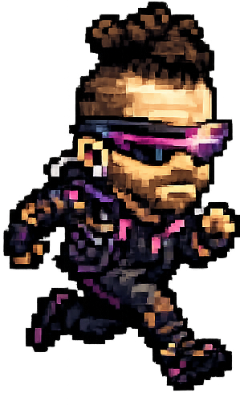
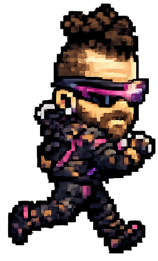

## 10D - Animate your player

Switch costumes while the **Player** moves so the character feels more alive.

## Step 1

> [!TASK]
>
> Select the **Player** sprite and open the **Costumes** tab.
>
> Check that the sprite has more than one costume. You can make one by duplicating the existing costume and editing it to look slightly different, or making a new one:
>
> [{:width="300px"}](images/netrunner1.png)
>
> [{:width="300px"}](images/netrunner2.png)

## Step 2

> [!TASK]
>
> Open the **Code** tab and add this animation script.
>
> ```blocks3
> when green flag clicked
> forever
>   if <<not <(x speed) = (0)>> and <(on ground) = (1)>> then
>     next costume
>     wait (0.05) seconds
>   end
> end
> ```
>
> Type your own delay into the `wait`{:class="block3control"} block (0.05 is a good place to start!)

## Test

> [!TASK]
>
> Move the **Player** and check that the costume changes while it travels.
