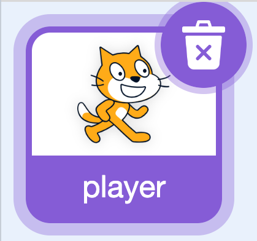
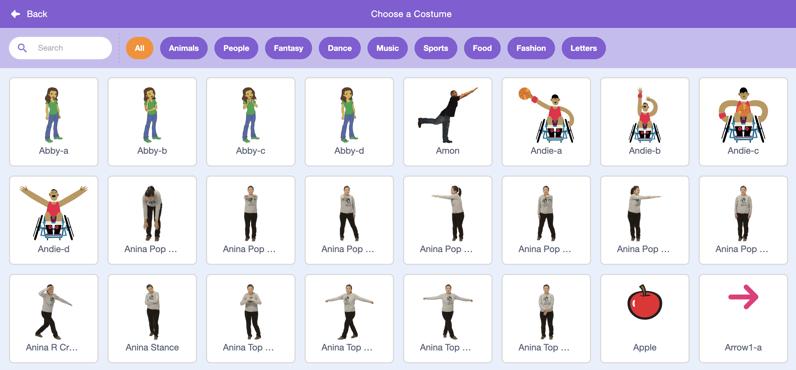

## 2C - Choose Inbuilt Player

Choose a costume from the Scratch library for the existing **Player** sprite in the starter project.

The **Player** sprite already has code that handles gravity, jumping, and falling. Change the costume in these steps, but do not delete or change the code unless a later step tells you to, or the game might stop working properly.

## Step 1

> [!TASK]
>
> Select the **Player** sprite in the sprite pane.
>
> 

## Step 2

> [!TASK]
>
> Open the **Costumes** tab.
>
> 

## Step 3

> ![TASK]
>
> Delete the **Cat-a** and **Cat-b** costumes.
>
> 

## Step 4

> [!TASK]
>
> Open the costume menu and select **Choose a Costume**.
>
> 

## Step 5

> [!TASK]
>
> Pick a costume from the Scratch library. Choose one that is clear, easy to see, and a good fit for the world of your platformer.
>
> For a classic platformer, a costume with legs, wheels, or a clear body shape is usually easier to understand as the player.

## Step 6

> [!TASK]
>
> Add the costume to the **Player** sprite. If the **Player** already has another costume, keep it because you may be able to use it for an animation later.

## Step 7

> [!TASK]
>
> On the **Code** tab, add blocks to set the starting position of your player. You can change this later
>
> ```blocks3
> when flag clicked
> go to x: (100) y: (100)
> ```

## Test

> [!TASK]
>
> Check that the **Player** sprite shows your chosen costume on the Stage and is easy to see against your backdrop.
