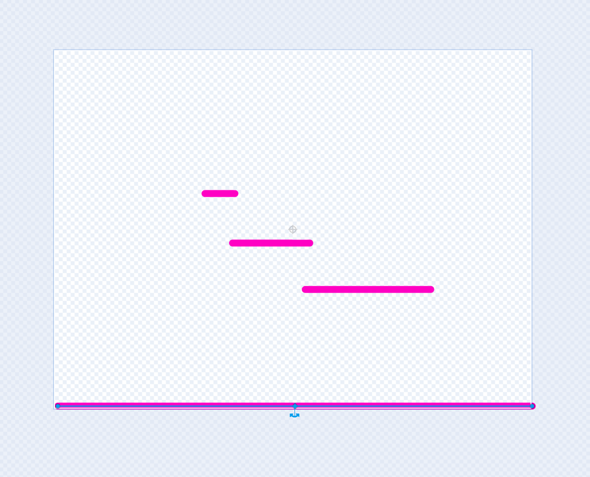

## 3A - Add platforms to match your backdrop

Add a **Platform** sprite with lines that match places in your backdrop where the **Player** can stand and jump.

## Step 1

> [!TASK]
>
> Open the **Choose a Sprite** menu and select **Paint**.
>
> 

## Step 2

> [!TASK]
>
> Draw horizontal lines in the **Platform** sprite for the floor, ledges, and backdrop details where the **Player** can stand.
>
> Use a bright colour, such as pink, so you can see exactly where the platforms are.
>
> The lines do not have to look like foreground platforms. Line them up with details in your backdrop, so a table, shelf, branch, or rock looks like it is acting as the platform.
>
> {:width="520px"}
>
> {:width="520px"}

## Step 3

> [!TASK]
>
> In the sprite pane, change the sprite name to **Platform**. Use this exact spelling so later steps can check whether the **Player** is touching it.

## Step 4

> [!TASK]
>
> Put the **Platform** sprite in the centre of the Stage.
>
> The platform lines should match the places where you want the **Player** to stand.
>
> > [!TIP]
> >
> > Once your platform lines are in the right places, you can make them invisible. In the **Costumes** tab, select the platform lines and set the fill and outline colours to transparent.
> >
> > This lets the **Player** stand on the invisible **Platform** sprite while the backdrop details look like the real platforms.

## Step 5

> [!TASK]
>
> Open the **Code** tab.
>
> 

## Step 6

> [!TASK]
>
> Add a script that starts when the green flag is clicked.
>
> ```blocks3
> +when green flag clicked
> ```

## Step 7

> [!TASK]
>
> Add a block to show the **Platform** sprite.
>
> ```blocks3
> when green flag clicked
> +show
> ```

## Test

> [!TASK]
>
> Click the green flag and check that the **Platform** sprite lines appear where the **Player** can stand or jump to them.
>
> If you made the lines transparent, check that the **Player** can still stand where the platform lines used to be.
