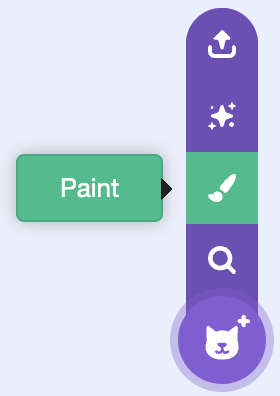

## 3B - Draw foreground platforms

Draw visible foreground platforms in one **Platform** sprite so the **Player** has places to stand and jump.

## Step 1

> [!TASK]
>
> Open the **Choose a Sprite** menu and select **Paint**.
>
> 

## Step 2

> [!TASK]
>
> Draw the foreground platforms in the **Platform** sprite.
>
> The place where the **Player** stands must have a straight, horizontal top.
>
> Draw every platform for the level in this one sprite. You can also copy and paste platform images into the paint editor, then arrange them where you want them.
>
> If you paste an image, crop or delete any empty pixels around it so the artwork fits tightly around the platform.

## Step 3

> [!TASK]
>
> In the sprite pane, change the sprite name to **Platform**.
>
> Use this exact spelling so later steps can check whether the **Player** is touching the **Platform** sprite.

## Step 4

> [!TASK]
>
> Put the **Platform** sprite in the centre of the Stage.
>
> The foreground platform drawings should match the places where you want the **Player** to stand.

## Step 5

> [!TASK]
>
> Open the **Code** tab.
>
> 

## Step 6

> [!TASK]
>
> Add a script that starts when the green flag is clicked.
>
> ```blocks3
> +when green flag clicked
> ```

## Step 7

> [!TASK]
>
> Add blocks to show the **Platform** sprite, move it to the front layer, put it in the centre of the Stage, and set its size.
>
> ```blocks3
> when green flag clicked
> +show
> +go to [front v] layer
> +go to x: (0) y: (0)
> +set size to (100)%
> ```

## Test

> [!TASK]
>
> Click the green flag and check that the foreground platforms appear in front of the backdrop in the places you chose.
>
> The **Player** should be able to stand or jump on each foreground platform.
