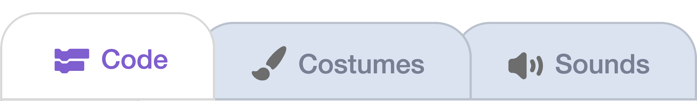

## 4A - Keys

Add keyboard controls so the **Player** can run and jump.

## Step 1

> [!TASK]
>
> Select the **Player** sprite in the sprite pane.

## Step 2

> [!TASK]
>
> Open the **Code** tab.
>
> 

The starter project already includes an `Up Down Helper` block, and the **Player** setup script with these **player** variables:

`x speed`{:class="block3variables"}, `y speed`{:class="block3variables"}, `gravity`{:class="block3variables"}, `jump strength`{:class="block3variables"}, `move speed`{:class="block3variables"}, `on ground`, `vertical steps`{:class="block3variables"}

## Step 3

> [!TASK]
>
> Add a `forever`{:class="block3control"} loop to your starting script and set `x speed`{:class="block3variables"} to `0`.
>
> ```blocks3
> when green flag clicked
> go to x: (100) y: (100)
> +forever
> +  set [x speed v] to (0)
> +end
> ```

## Step 4

> [!TASK]
>
> Inside the `forever`{:class="block3control"} loop, add an `if`{:class="block3control"} block for moving right.
>
> If the `right arrow` key is pressed, set `x speed`{:class="block3variables"} to `move speed` and point the **Player** right.
>
> ```blocks3
> when green flag clicked
> forever
>   set [x speed v] to (0)
>
> +  if <key [right arrow v] pressed?> then
> +    set [x speed v] to (move speed)
> +    point in direction (90)
> +  end
> end
> ```

## Step 5

> [!TASK]
>
> Add another `if`{:class="block3control"} block for moving left.
>
> If the `left arrow` key is pressed, set `x speed`{:class="block3variables"} to `0 - move speed` and point the **Player** left.
>
> ```blocks3
> when green flag clicked
> forever
>   set [x speed v] to (0)
>
>   if <key [right arrow v] pressed?> then
>     set [x speed v] to (move speed)
>     point in direction (90)
>   end
>
> +  if <key [left arrow v] pressed?> then
> +    set [x speed v] to ((0) - (move speed))
> +    point in direction (-90)
> +  end
> end
> ```

## Step 6

> [!TASK]
>
> At the bottom of the `forever`{:class="block3control"} loop, add `change x by (x speed)`{:class="block3motion"}.
>
> This moves the **Player** by the speed chosen by the key presses.
>
> ```blocks3
> when green flag clicked
> forever
>   set [x speed v] to (0)
>
>   if <key [right arrow v] pressed?> then
>     set [x speed v] to (move speed)
>     point in direction (90)
>   end
>
>   if <key [left arrow v] pressed?> then
>     set [x speed v] to ((0) - (move speed))
>     point in direction (-90)
>   end
>
> +  change x by (x speed)
> end
> ```

## Test

> [!TASK]
>
> Click the green flag and use the arrow keys to move left and right.
>
> If the **Player** moves too quickly or too slowly, change `move speed` in the starter setup script.
