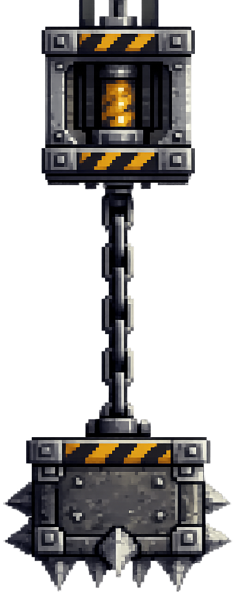

<h2 class="c-project-heading--task">10B - Y-motion Hazards</h2>

Add a hazard like spikes that move up and down to create danger.

## Step 1

> [!TASK]
>
> Create a new sprite for your hazard and give it an obvious name like **Hazard**.
>
> If you already made a **static hazard** like spikes or lava, you can **duplicate** that sprite and use it here.
>
> {:width="220px"}

## Step 2

> [!TASK]
>
> Resize and place the **Hazard** sprite where you want it to start.
>
> Put it above or below a risky part of the level so it can move up and down across the player's path.

## Step 3

> [!TASK]
>
> Add these blocks to the **Hazard** sprite.
>
> Keep the two `x`{:class="block3motion"} positions the same. Change the two `y`{:class="block3motion"} positions to make the hazard move up and down.
>
> ```blocks3
> when green flag clicked
> go to x: () y: ()
> forever
>   glide () secs to x: () y: ()
>   glide () secs to x: () y: ()
> end
> ```

## Step 4

> [!TASK]
>
> Click on the **Player** sprite and add these blocks:
>
> ```blocks3
> when green flag clicked
> forever
>   if <touching [Hazard v]?> then
>     set [x speed v] to (0)
>     set [y speed v] to (0)
>     go to x: () y: ()
>   end
> end
> ```

> [!TASK]
>
> Add the same position you used in the **Player** starting script into `go to x: y:`{:class="block3motion"}.
>
> This resets the **Player** instead of stopping the game.

## Test

> [!TASK]
>
> Click the green flag and check that the **Hazard** moves up and down and sends the **Player** back to the start position on contact.
