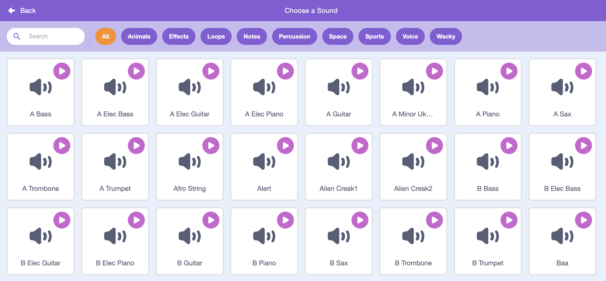

<h2 class="c-project-heading--task">10F - Add Sound effects</h2>

Add sound effects to make moments such as jumping, collecting items, winning, or danger feel more realistic.

## Step 1

> [!TASK]
>
> Click the sprite you want to add a sound effect to.

## Step 2

> [!TASK]
>
> Select the **Sounds** tab and then **Choose a Sound**.
>
> 
> 


## Step 3

> [!TASK]
>
> Choose a sound effect from the library.
>
> 

## Step 4

> [!TASK]
>
> Add `start sound`{:class="block3sounds"} inside the blocks you want it to play. For example, when collecting a coin, or in a block that makes a sprite jump.
>
> ```blocks3
> start sound [effect v]
> ```

<h2 class="c-project-heading--task">Test</h2>

> [!TASK]
>
> Click the green flag and check that the sound works.
