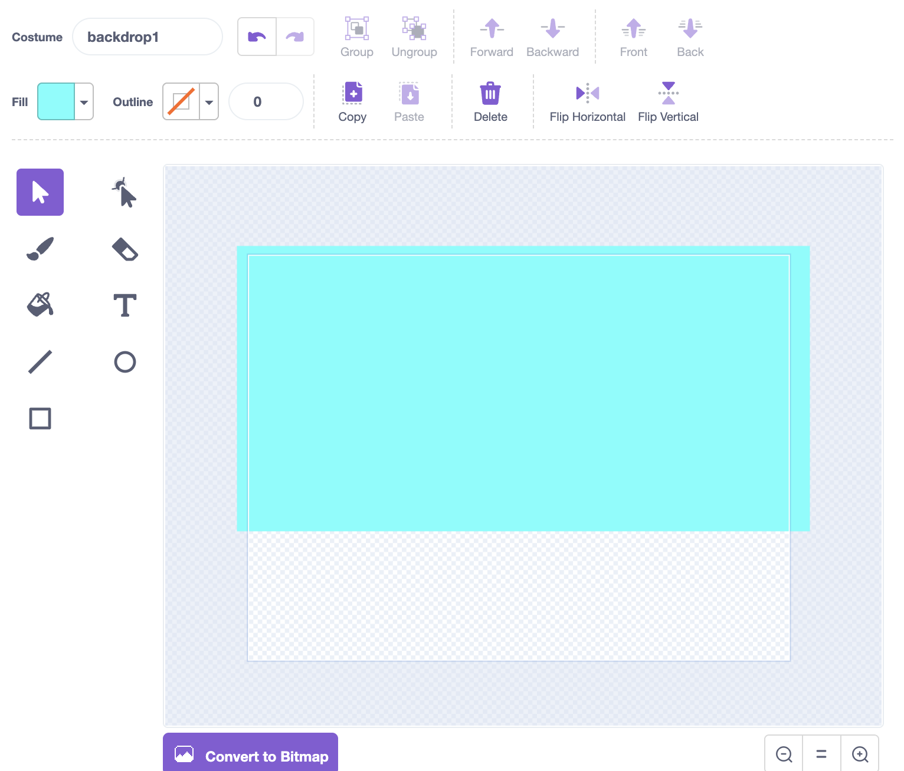

<h2 class="c-project-heading--task">1A - Draw Backdrop</h2>

## Step 1

> [!TASK]
>
> Choose **Paint** in the backdrop menu.
>
> 

## Step 2

> [!TASK]
>
> Use the paint tools to draw your a backdrop based on the world your game is in.
>
> 

## Step 3

> [!TASK]
>
> Name the backdrop so you can find it again later.
>
> 
