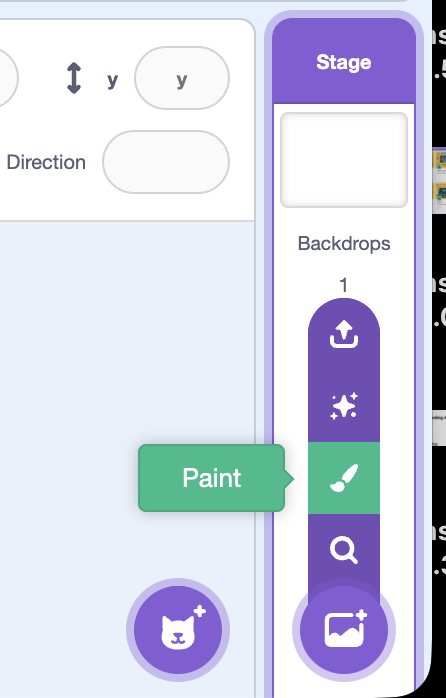

<h2 class="c-project-heading--task">1A - Draw Backdrop</h2>

## Step 1

> [!TASK]
>
> Open the [Starter project](https://scratch.mit.edu/projects/1331944494/editor){:target="_blank"}.

## Step 2

> [!TASK]
>
> In the **Stage**, choose **Paint** in the backdrop menu.
>
> 

## Step 3

> [!TASK]
>
> Use the paint tools to draw your a backdrop based on the world your game is set in.
>
> 

## Step 4

> [!TASK]
>
> Name the backdrop so you can find it again later.
>
> 
