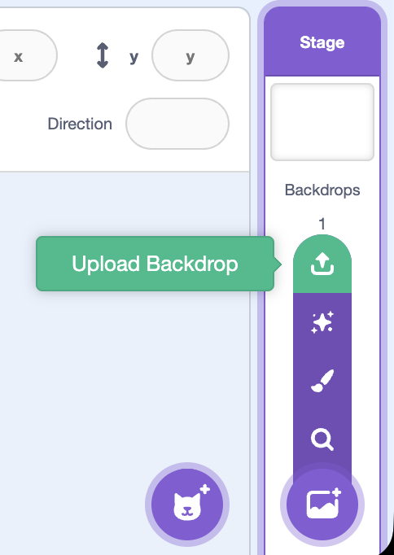
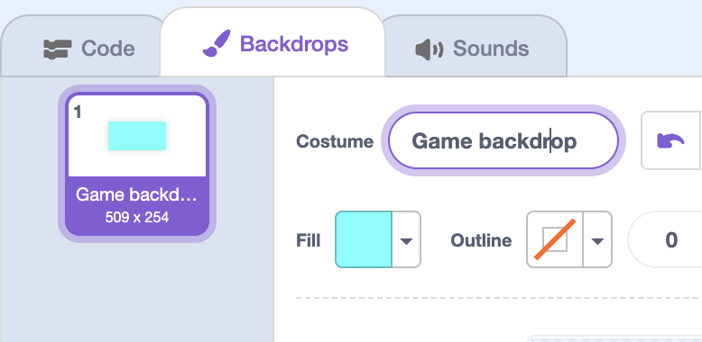

<h2 class="c-project-heading--task">1B - Upload Backdrop</h2>

## Step 1

> [!TASK]
>
> Make sure you already have an image you want to use saved onto your computer.
>
> > [!TIP]
> >
> > You can try using one of these
> > 
> >
> >

## Step 2

> [!TASK]
>
> In the **Stage**, choose **Upload Backdrop** in the menu, and pick an image from your device.
>
> 

## Step 3

> [!TASK]
>
> Use the paint tools to select and resize your a backdrop so that it fills the screen
>
> 

## Step 4

> [!TASK]
>
> Name the backdrop so you can find it again later.
>
> 
