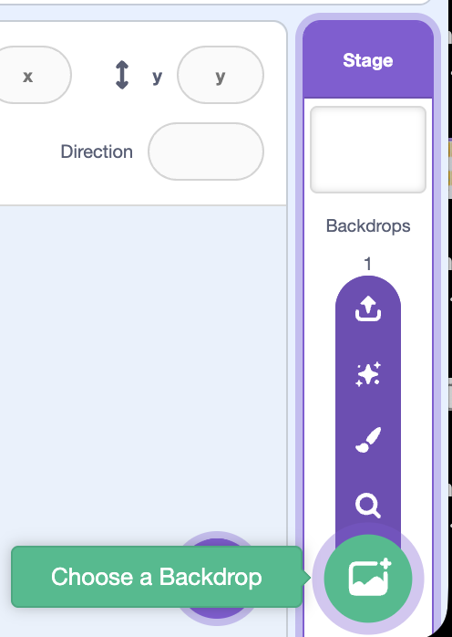

<h2 class="c-project-heading--task">1C - Choose Inbuilt Backdrop</h2>

## Step 1

> [!TASK]
>
> In the **Stage**, select **Choose a Backdrop** in the menu.
>
> 

## Step 2

> [!TASK]
>
> Pick a backdrop.

## Step 3

> [!TASK]
>
> Name the backdrop so you can find it again later.
>
> 
