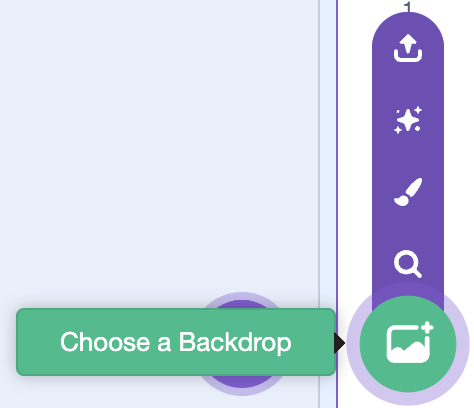

<h2 class="c-project-heading--task">1C - Choose Inbuilt Backdrop</h2>

## Step 1

Select **Choose a Backdrop** in the menu. 

## Step 2

Pick a backdrop.

## Step 3

Name the backdrop so you can find it again later.

