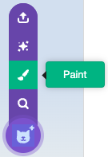

## 2A - Draw Player

Draw your own costume for the existing **player** sprite in the starter project.

## Step 1

> [!TASK]
>
> Select the **Player** sprite in the sprite pane.
> 
> 

## Step 2

> [!TASK]
>
> Open the **Costumes** tab.
>
> 

## Step 3

> [!TASK]
>
> Open the costume menu and select **Paint** to add a new costume to the **Player** sprite.
>
> 

## Step 4

> [!TASK]
>
> Draw a simple character for your platformer. Your player could be a person, robot, creature, animal, or simple shape.
>
> Use a clear outline and colours that stand out from your backdrop. Keep the design easy to recognise when it is small on the Stage.

## Step 5

> [!TASK]
>
> Check that your costume is facing sideways or is easy to turn sideways later. A platformer player usually moves left and right, so a side-on character will be easier to animate.

## Test

> [!TASK]
>
> Check that the **Player** sprite shows your new costume on the Stage. If it is too large, use the **Size** control in the sprite pane to make it smaller.
