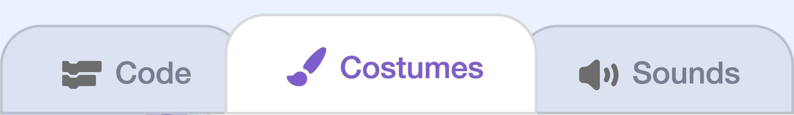
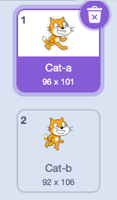

## 2B - Upload Player

Upload an image as a costume for the existing **Player** sprite in the starter project.


## Step 1

Make sure you already have an image you want to use saved onto your computer.

> [!TIP]
>
> try using one of these
> [{:width="300px"}](images/example-sprite-player-robot.png)
>
> [{:width="300px"}](images/example-sprite-player-adventurer.png)
>
> [{:width="300px"}](images/example-sprite-player-creature.png)

## Step 2

> [!TASK]
>
> Select the **Player** sprite in the sprite pane.
>
> 

## Step 3

> [!TASK]
>
> Open the **Costumes** tab.
>
> 

## Step 4

>![TASK]
>
> Delete the **Cat-a** and **Cat-b** costumes.
>
> 
>

## Step 5

> [!TASK]
>
> Open the costume menu and choose the **Upload Costume** icon.

## Step 6

> [!TASK]
>
> Select your player image from your computer. Scratch will add it as a new costume for the **Player** sprite.

## Step 7

> [!TASK]
>
> On the **Code** tab, add blocks to set the starting position of your player. You can change this later
> ```blocks3
> when flag clicked
> go to x: (100) y: (100)
> ```

## Test

> [!TASK]
>
> Check that the **Player** sprite shows your uploaded costume on the Stage. If it is too large, use the **Size** control in the sprite pane to make it smaller.
