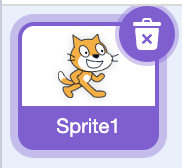
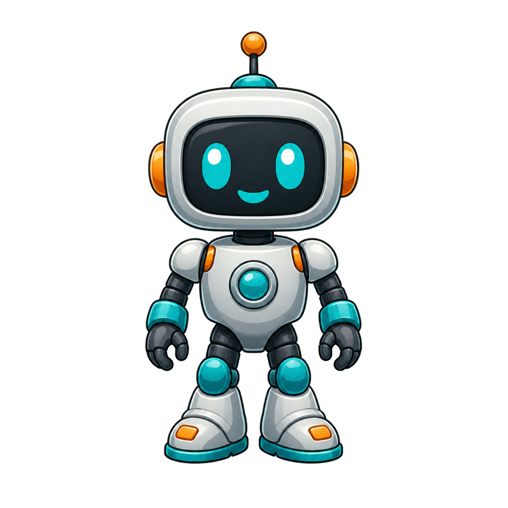
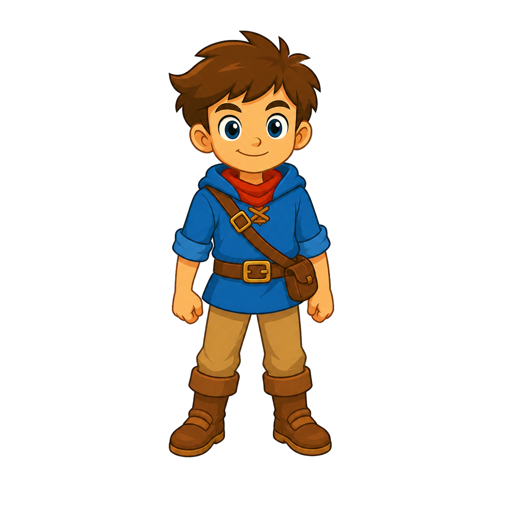
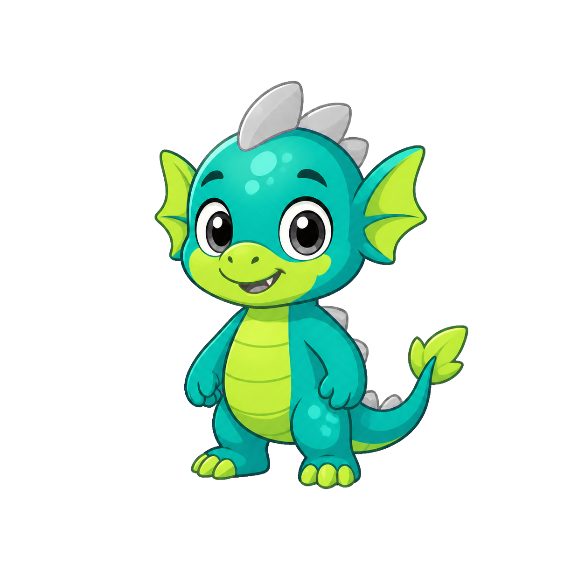
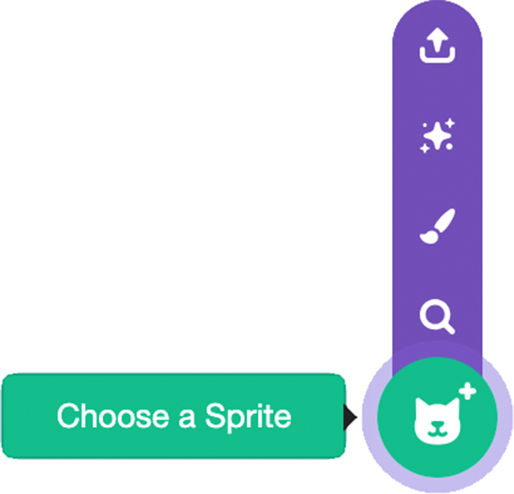

<h2 class="c-project-heading--task">2B - Upload Player</h2>

Upload an image and use it as the **Player** sprite.

## Step 1

If the Scratch cat sprite is still in your project, delete it. Click the **Delete** icon on the sprite thumbnail.

## Step 2

Make sure the image you want to use is saved on your computer. A transparent-background PNG is usually easiest to use for a player sprite.

These examples show the kind of clear, full-body image that works well for a platformer player.

## Step 3

Open the **Choose a Sprite** menu and select the **Upload Sprite** icon.

## Step 4

Select your player image from your computer. Scratch will add it as a new sprite on the Stage.

## Step 5

In the sprite pane, change the sprite name to **Player**. Use this exact spelling so later steps can refer to the same sprite.

<h2 class="c-project-heading--task">Test</h2>

Check the **Player** sprite on the Stage. If it is too large, use the **Size** control in the sprite pane to make it smaller.
