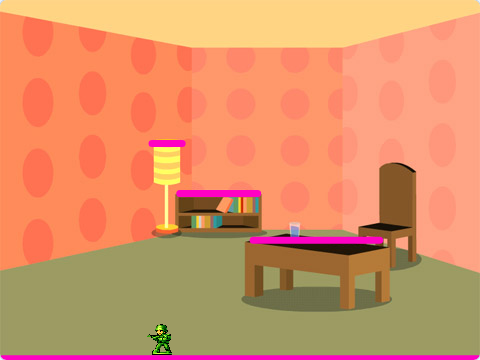

## 3B - Make a Moving Platform

Make one **Platform** sprite create platform clones, then make one platform glide between two places.

## Step 1

> [!TASK]
>
> Open the **Choose a Sprite** menu and select **Paint**.
>
> Draw one bright horizontal line for the platform.
>
> Use a bright colour, such as pink, so you can see exactly where the platform is. You can line the platform up with details in your backdrop, so a table, shelf, branch, or rock looks like it is acting as the platform.
>
> 
>
> {:width="520px"}
>
> {:width="520px"}

## Step 2

> [!TASK]
>
> In the sprite pane, change the sprite name to **Platform**.
>
> Use this exact spelling so later steps can check whether the **Player** is touching the **Platform** sprite or any of its clones.
>
> You do not need separate sprites called `Platform1`, `Platform2`, or `Platform3`.

## Step 3

> [!TASK]
>
> Open the **Code** tab.
>
> 

## Step 4

> [!TASK]
>
> Add a script that starts when the green flag is clicked.
>
> Hide the original **Platform** sprite, move it to the front layer, and set its size.
>
> ```blocks3
> +when green flag clicked
> +hide
> +go to [front v] layer
> +set size to (100)%
> ```

## Step 5

> [!TASK]
>
> Add blocks to move the **Platform** sprite to the floor position, show it, and create a clone.
>
> Change the `x` and `y` values to match your own level.
>
> ```blocks3
> when green flag clicked
> hide
> go to [front v] layer
> set size to (100)%
> +go to x: (0) y: (-150)
> +show
> +create clone of [myself v]
> ```

## Step 6

> [!TASK]
>
> Add more `go to x: y:`{:class="block3motion"} and `create clone of [myself v]`{:class="block3control"} blocks for each extra fixed platform.
>
> These clones are still part of the **Platform** sprite.
>
> ```blocks3
> when green flag clicked
> hide
> go to [front v] layer
> set size to (100)%
> go to x: (0) y: (-150)
> show
> create clone of [myself v]
> +go to x: (-120) y: (-40)
> +create clone of [myself v]
> +go to x: (140) y: (20)
> +create clone of [myself v]
> ```

## Step 7

> [!TASK]
>
> Add a second script to the **Platform** sprite that starts when each clone is created.
>
> Make each clone show and go to the front layer.
>
> ```blocks3
> +when I start as a clone
> +show
> +go to [front v] layer
> ```

## Step 8

> [!TASK]
>
> Go back to the green flag script.
>
> The fixed platforms are clones, and the original **Platform** sprite is the one that moves.
>
> Move the original **Platform** sprite to the start position for the moving platform.
>
> ```blocks3
> when green flag clicked
> hide
> go to [front v] layer
> set size to (100)%
> go to x: (0) y: (-150)
> show
> create clone of [myself v]
> go to x: (-120) y: (-40)
> create clone of [myself v]
> go to x: (140) y: (20)
> create clone of [myself v]
> +go to x: (-180) y: (80)
> +show
> ```

## Step 9

> [!TASK]
>
> Add a `forever`{:class="block3control"} loop below the moving platform's start position.
>
> ```blocks3
> when green flag clicked
> hide
> go to [front v] layer
> set size to (100)%
> go to x: (0) y: (-150)
> show
> create clone of [myself v]
> go to x: (-120) y: (-40)
> create clone of [myself v]
> go to x: (140) y: (20)
> create clone of [myself v]
> go to x: (-180) y: (80)
> show
> +forever
> +end
> ```

## Step 10

> [!TASK]
>
> Inside the `forever`{:class="block3control"} loop, add two `glide`{:class="block3motion"} blocks.
>
> The original **Platform** sprite will glide between these two places. Change the numbers to fit your level.
>
> ```blocks3
> when green flag clicked
> hide
> go to [front v] layer
> set size to (100)%
> go to x: (0) y: (-150)
> show
> create clone of [myself v]
> go to x: (-120) y: (-40)
> create clone of [myself v]
> go to x: (140) y: (20)
> create clone of [myself v]
> go to x: (-180) y: (80)
> show
> forever
> +  glide (2) secs to x: (180) y: (80)
> +  glide (2) secs to x: (-180) y: (80)
> end
> ```

## Test

> [!TASK]
>
> Click the green flag and check that the fixed platform clones appear.
>
> Check that the moving platform glides between the two places you chose.
>
> The **Player** should be able to stand or jump on the fixed platform clones and the moving **Platform** sprite.
