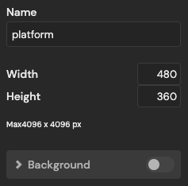
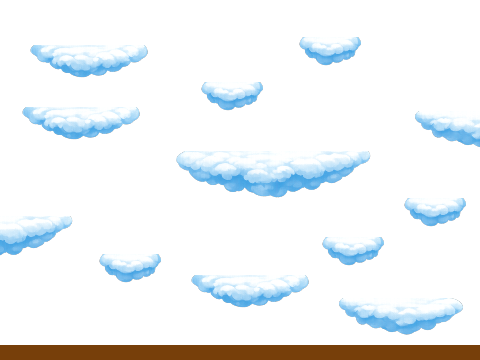
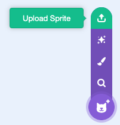

## 3C - Draw platforms in another editor

To draw fancier platforms and montage other images, you can use an editor on your computer or one online like [pixlr](https://pixlr.com/){:target="_blank"}

## Step 1

> [!TASK]
>
> Create a new file in your editor. Make sure to choose a size of 480 x 360 pixels and a transparent background
>
> 

## Step 2

> [!TASK]
>
> Draw your ground and platforms. You don't need it to be perfect. You can come back and edit it later.
>
> 

## Step 3

> [!TASK]
>
> Export or Save your platforms as a PNG file.

## Step 4

> [!TASK]
>
> Upload a new sprite and choose the image you've drawn. Rename it to **platform**
>
> 

## Step 5

> [!TASK]
>
> You can resize and edit your platforms in the costume editor if needed.

