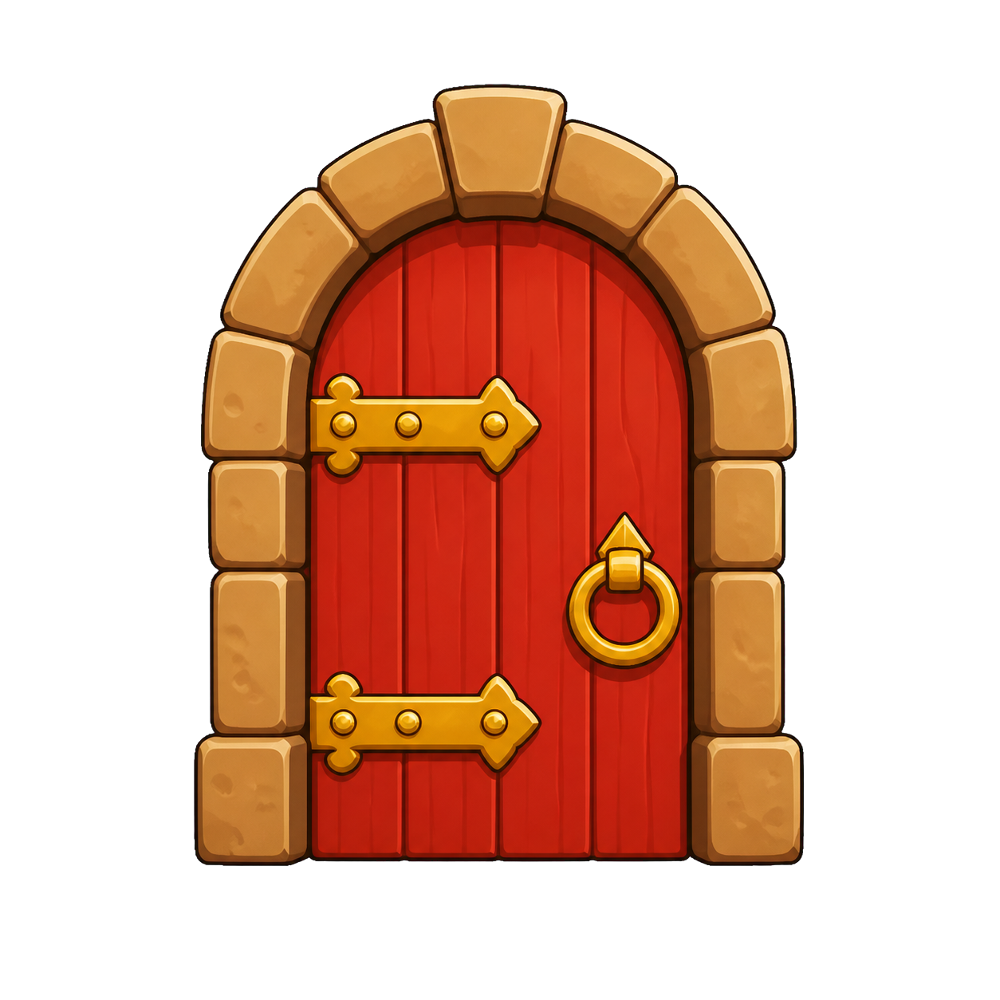
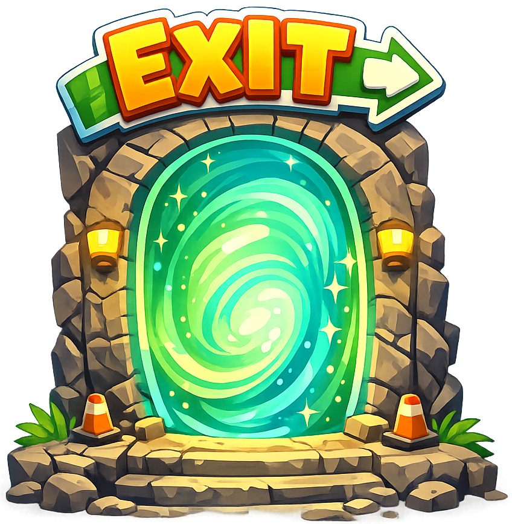

## 6B - Upload Exit Sprite

Upload an image and use it as the **Exit** sprite, the way to finish the level.

## Step 1

> [!TASK]
>
> Make sure the exit image you want to use is saved on your computer.
>
> Use an image you made yourself or have permission to use.
>
> 
>
> 

## Step 2

> [!TASK]
>
> Open the **Choose a Sprite** menu and select the **Upload Sprite** icon.
>
> 

## Step 3

> [!TASK]
>
> Select your exit image from your computer. Scratch will add it as a new sprite on the Stage.

## Step 4

> [!TASK]
>
> In the sprite pane, change the sprite name to **Exit**. Use this exact spelling so later steps can refer to the same sprite.

## Step 5

> [!TASK]
>
> Select the **Exit** sprite and add a script that starts when the green flag is clicked.
>
> ```blocks3
> +when green flag clicked
> ```

## Step 6

> [!TASK]
>
> Add a `show`{:class="block3looks"} block below the green flag block.
>
> ```blocks3
> when green flag clicked
> +show
> ```

## Step 7

> [!TASK]
>
> Move the **Exit** sprite to where you want the door to be in the level.
>
> Drag it on the Stage so you can see the coordinates you want to use.

## Step 8

> [!TASK]
>
> Add a `go to x: () y: ()`{:class="block3motion"} block below `show`{:class="block3looks"}.
>
> The coordinates of the exit position should appear in the white inputs to set its starting place, but if not you can copy them from the sprite.
>
> ```blocks3
> when green flag clicked
> show
> +go to x: () y: ()
> ```

## Test

> [!TASK]
>
> Click the green flag and check that your uploaded **Exit** sprite appears where the player can reach it.
