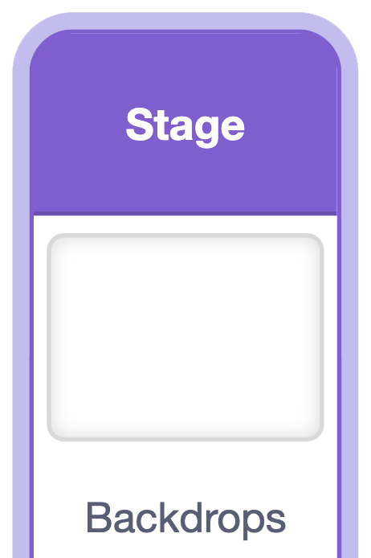

<h2 class="c-project-heading--task">9E - Add Music</h2>

Add background music to give your game atmosphere.

## Step 1

> [!TASK]
>
> Click on the **Stage**.
>
> 


## Step 2

> [!TASK]
>
> Select the **Sounds** tab and then **Choose a Sound**.
>
> 
> 

## Step 3

> [!TASK]
>
> From the list of sounds, select the one your want to use.
>
> [](images/list-sounds.png)

## Step 4

> [!TASK]
>
> Click the **Code** tab and add the blocks below.
>
> Select your music from the `sound`{:class="block3sounds"} menu.
>
> ```blocks3
> when green flag clicked
> forever
>   play sound [music v] until done
> end
> ```

<h2 class="c-project-heading--task">Test</h2>

> [!TASK]
>
> Click the green flag and check that the music plays.
