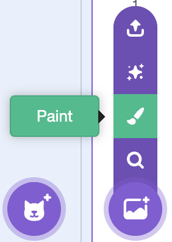

<h2 class="c-project-heading--task">1A - Draw Backdrop</h2>

Draw your a backdrop for your game.

 so your platformer has a world that matches your idea.

## Step 1
Choose **Paint** in the backdrop menu. Use big clear shapes and leave open space for platforms, dangers, and the exit.

## Step 2

Name the backdrop so you can find it again later.

## Step 3

<h2 class="c-project-heading--task">Test</h2>

Check that your backdrop is visible on the Stage and has enough clear space for a platformer level.

### Choose this route if...

You want a backdrop that feels personal. Simple shapes are enough: sky, cave, forest, space, city, or another setting.