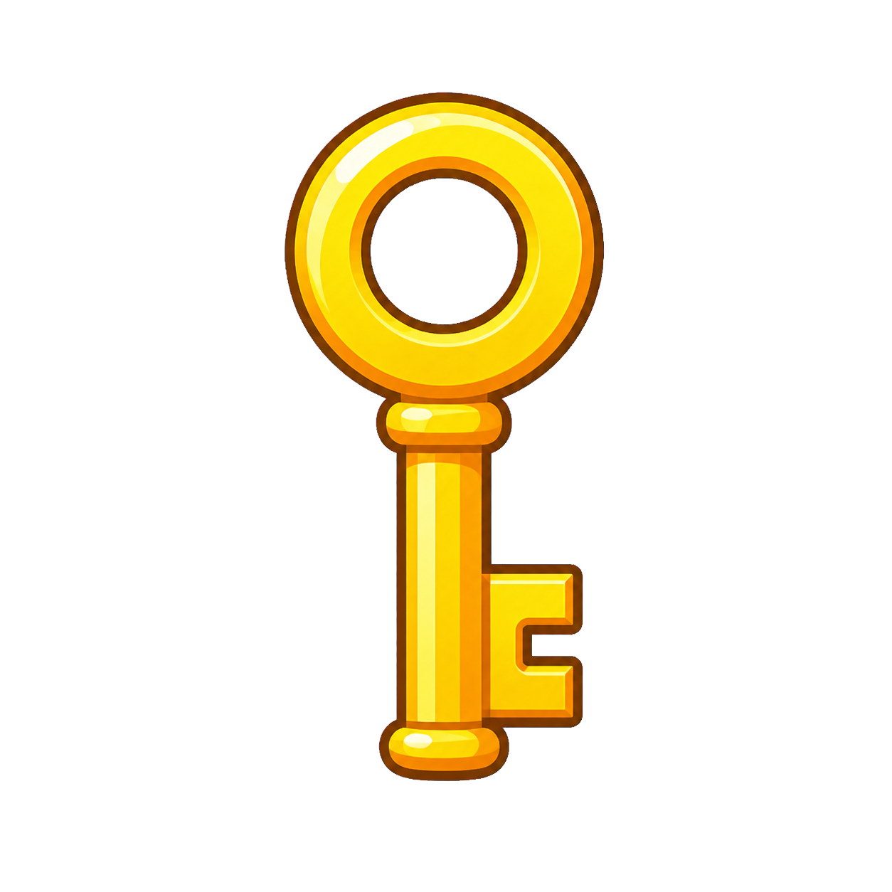

<h2 class="c-project-heading--task">7C - Has Key & Get to Exit Sprite</h2>

Make the player win only after collecting a key and reaching the `Exit`.

### Starting here?

Add sprites called `Player`, `Key`, and `Exit`. Make a variable called `has key` for all sprites.

### Choose this route if...

You want a puzzle-style win condition with two linked goals.

### Build it

Place the key somewhere interesting and put the exit where the player can reach it after collecting the key.

[](images/key.png)

[](images/exit-door.png)

Add this code to the Stage.

```blocks3
when green flag clicked
set [has key v] to [0]
```

Add this code to the Key sprite.

```blocks3
when green flag clicked
show
forever
  if <touching [Player v]?> then
    set [has key v] to [1]
    hide
  end
end
```

Add this code to the Exit sprite.

```blocks3
when green flag clicked
forever
  if <touching [Player v]?> then
    if <(has key) = [1]> then
      broadcast [win v]
      say [Unlocked!] for (2) seconds
      stop [this script v]
    else
      say [] for (2) seconds
    end
  end
end
```

<h2 class="c-project-heading--task">Test</h2>

Touch the exit before and after collecting the key to check that only the keyed route wins.
