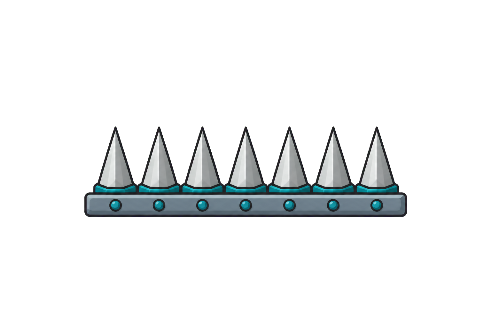

<h2 class="c-project-heading--task">Add falling spikes or danger zones</h2>

Add a spike hazard or falling danger so the player has a risky area to avoid.

### Choose this route if...

You want a visible danger that feels different from an enemy.

### Drop a hazard into the level

You can keep the spikes still as a danger zone, or use the code below to make them fall and reset. Change the positions and timing so they fit your own level.

[](images/spikes.png)

Add this code to the Spike sprite:

```blocks3
when I receive [start game v]
show
go to x: (start x) y: (start y)
forever
  glide (drop time) secs to x: (end x) y: (end y)
  go to x: (start x) y: (start y)
  wait (reset delay) seconds
end
```


<h2 class="c-project-heading--task">Test</h2>

Click the green flag and check that the spikes appear where you expect and behave like a hazard.
