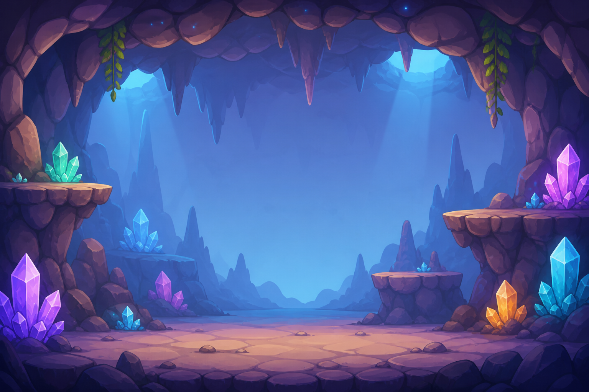
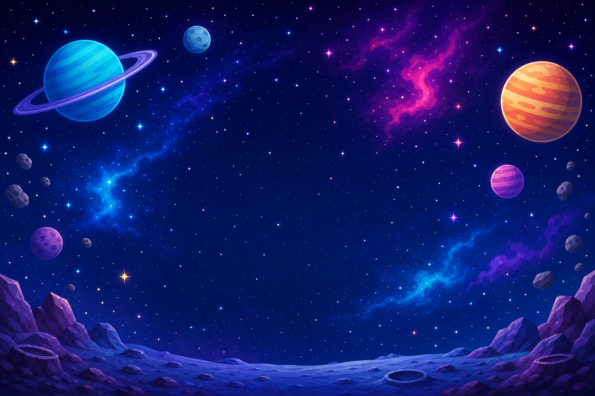

<h2 class="c-project-heading--task">Use an example generated backdrop</h2>

Use one of the example PNG backdrops if you want a ready-made world without drawing or uploading your own image.

### Starting here?

You can start here with a new Scratch project.

### Choose this route if...

You want a quick backdrop but you would like something different from the Scratch library.

### Upload one of the example backdrops

Choose **Upload Backdrop** and pick one of these example backdrops. Use the name of the backdrop you chose in the block below.

[](images/example-backdrop-sky-platforms.png)

[](images/example-backdrop-forest-platforms.png)

[](images/example-backdrop-cave-platforms.png)

[](images/example-backdrop-space-platforms.png)

Choose your own backdrop name in the menu below.

Add this code to the Stage:

```blocks3
when I receive [start game v]
switch backdrop to [ v]
```


<h2 class="c-project-heading--task">Test</h2>

Click the green flag and check that your example backdrop appears on the Stage.
