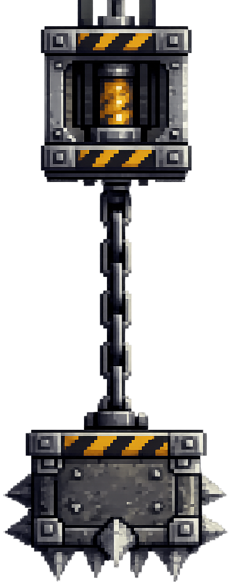
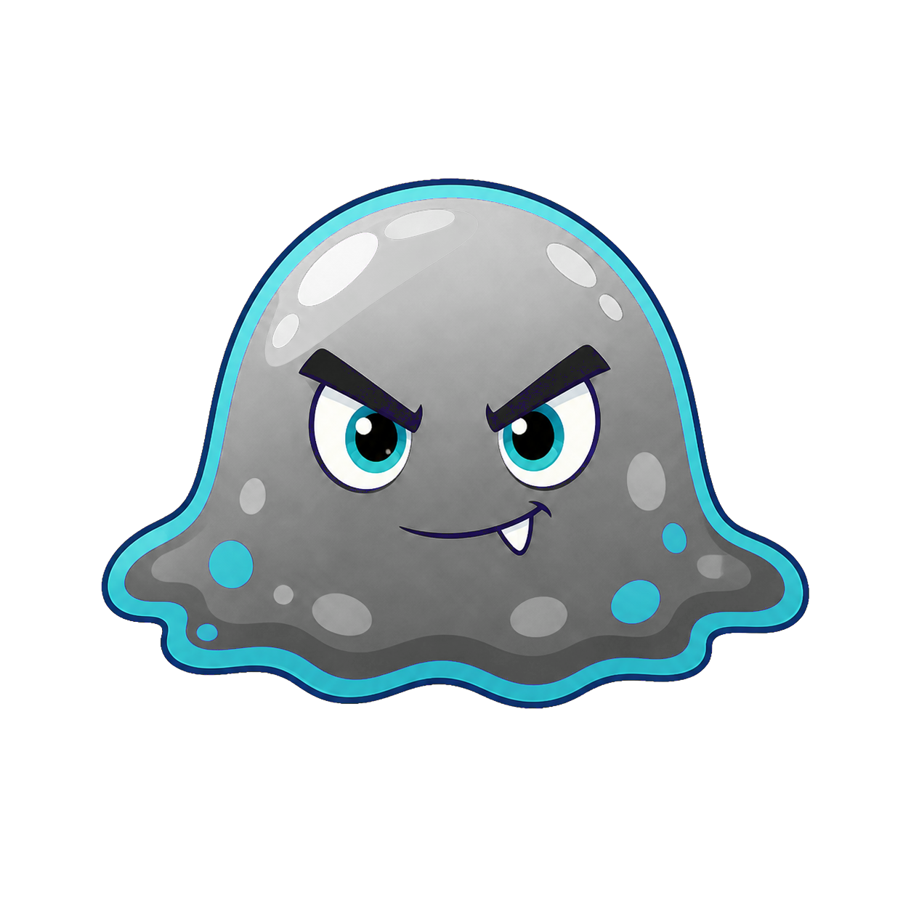

<h2 class="c-project-heading--task">9C - X-motion Hazards</h2>

Add a hazard like spikes that move left and right to create danger.

## Step 1

> [!TASK]
>
> Create a new sprite for your hazard and give it an obvious name like **Hazard**.
>
> If you already made a **static hazard** like spikes or lava, you can **duplicate** that sprite and use it here.
>
> {:width="420px"}
>
> > [!TIP]
> >
> > A hazard with a different costume can be an enemy. You could use this blob enemy as a moving hazard:
> > [{:width="300px"}](images/enemy-blob.png)

## Step 2

> [!TASK]
>
> Resize and place the **Hazard** sprite where you want it to start.
>
> Put it beside a platform, floor, or gap so it can move left and right across the player's path.

## Step 3

> [!TASK]
>
> Add these blocks to the **Hazard** sprite.
>
> Keep the two `y`{:class="block3motion"} positions the same. Change the two `x`{:class="block3motion"} positions to make the hazard move left and right.
>
> ```blocks3
> when green flag clicked
> go to x: () y: ()
> forever
>   glide () secs to x: () y: ()
>   glide () secs to x: () y: ()
> end
> ```

## Step 4

> [!TASK]
>
> Click on the **Player** sprite and add these blocks:
>
> ```blocks3
> when green flag clicked
> forever
>   if <touching [Hazard v]?> then
>     set [x speed v] to (0)
>     set [y speed v] to (0)
>     go to x: () y: ()
>   end
> end
> ```

> [!TASK]
>
> Add the same position you used in the **Player** starting script into `go to x: y:`{:class="block3motion"}.
>
> Esto reinicia al **Jugador** en lugar de detener el juego.

## Prueba

> [!TASK]
>
> Haz clic en la bandera verde y comprueba que el **Peligro** se mueve hacia la izquierda y hacia la derecha y devuelve al **Jugador** a la posición inicial al entrar en contacto con él.
